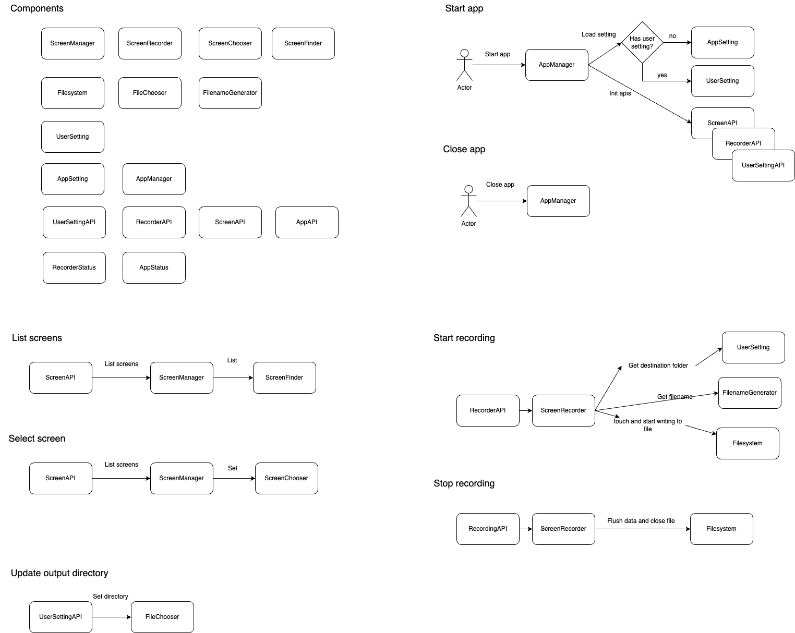

Note: The design below does not include UI compoents

backend: mainly apis for the app's behaviour
- ScreenManager: provide APIs to access the actual desktop screen
- ScreenFiner: provide APIs to find all the available screen
- ScreenChooser: allow users to choose the screen to record
- ScreenRecorder: main component to start / stop recording the screen.
- Filesystem: provide APIs for accessing device's filesystem
- FilenameGenerator; provide APIs to create unique filename
- FileChooser: provide APIs to save the recordings to the specified destination folder
- UserSetting: keep the user settings such as destination folder
- AppSetting: app-wise configurations
- AppManager: manage the lifecycle of the start / stop / error of the app and init apis
- Logger: write app-wise information to log file
- RecorderStatus: the recorder status
    - idle
    - processing
    - saving
    - stop
    - error
- AppStatus: the app status
    - idle
    - loading
    - busy
    - error

apis: apis to receive the action from frontend
- recorder
    - start / stop / save / status recordings
- user setting
    - load / save user settings
- screen
    - select / list screens
- app
  - status

frontend
- ScreenChooser: ui to choose the screen
- UserSettingDialog: ui to change settings
- FileChooser: ui to choose destination folder, a wrapper for native file chooser
- ScreenOverlay: ui to segregate the desktop and our app to allow operate only within our app
- RecordArea: ui to show the area being recorded
- RecorderStatus: ui to indicate the recording status
    - idle
    - processing
    - saving
    - stop
    - error
- AppStatus: ui to indicate the app status
    - idle
    - busy
    - error
- ErrorDialog: ui to show the error information
